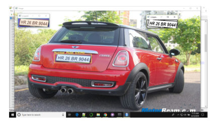

# Indian-Vehicle-License-Plate-Detection

**Basic approach**  
Take a ConvNet pretrained on Yolo, remove the last fully-connected layer , then treat the rest of the ConvNet as a fixed feature extractor for the new dataset.then, train a linear classifier (e.g. Linear SVM or Softmax classifier) for the new dataset.
Use python getdataset.py to download the dataset and generate annotation files for training.  
**Why Transfer learning**  
The dataset available to us is very minimal appx. 400 images only so, it is best to leverage Transfer learning for good results.
Instead of building the model from scratch, we will be using a pre-trained network and applying transfer learning to create our final model. You only look once (YOLO) is a state-of-the-art, real-time object detection system, which has a mAP on VOC 2007 of 78.6% and a mAP of 48.1% on the COCO test-dev. YOLO applies a single neural network to the full image. This network divides the image into regions and predicts the bounding boxes and probabilities for each region. These bounding boxes are weighted by the predicted probabilities.

One of the advantages of YOLO is that it looks at the whole image during the test time, so its predictions are informed by global context in the image. Unlike R-CNN, which requires thousands of networks for a single image, YOLO makes predictions with a single network. This makes this algorithm extremely fast, over 1000x faster than R-CNN and 100x faster than Fast R-CNN.  
**Training the model**  
Training is done using [Darknet](https://github.com/AlexeyAB/darknet?files=1#how-to-train-tiny-yolo-to-detect-your-custom-objects) framework.
 
  
**Intersection Over Union**  
Intersection over Union (IoU) is an evaluation metric that is used to measure the accuracy of an object detection algorithm. Generally, IoU is a measure of the overlap between two bounding boxes. To calculate this metric, we need:

The ground truth bounding boxes (i.e. the hand labeled bounding boxes)
The predicted bounding boxes from the model
Intersection over Union is the ratio of the area of intersection over the union area occupied by the ground truth bounding box and the predicted bounding box. Fig. 9 shows the IoU calculation for different bounding box scenarios.

Intersection over Union is the ratio of the area of intersection over the union area occupied by the ground truth bounding box and the predicted bounding box.
 
  
# Tackling Multiple Detection
**Threshold Filtering** 
he YOLO object detection algorithm will predict multiple overlapping bounding boxes for a given image. As not all bounding boxes contain the object to be classified (e.g. pedestrian, bike, car or truck) or detected, we need to filter out those bounding boxes that don’t contain the target object. To implement this, we monitor the value of pc, i.e., the probability or confidence of an object (i.e. the four classes) being present in the bounding box. If the value of pc is less than the threshold value, then we filter out that bounding box from the predicted bounding boxes. This threshold may vary from model to model and serve as a hyper-parameter for the model.

If predicted target variable is defined as:
  

then discard all bounding boxes where the value of pc < threshold value. The following code implements this approach.
 
**Non-max Suppression** 
Even after filtering by thresholding over the classes score, we may still end up with a lot of overlapping bounding boxes. This is because the YOLO algorithm may detect an object multiple times, which is one of its drawbacks. A second filter called non-maximal suppression (NMS) is used to remove duplicate detections of an object. Non-max suppression uses ‘Intersection over Union’ (IoU) to fix multiple detections.

Non-maximal suppression is implemented as follows:

Find the box confidence (pc) (Probability of the box containing the object) for each detection.
Pick the bounding box with the maximum box confidence. Output this box as prediction.
Discard any remaining bounding boxes which have an IoU greater than 0.5 with the bounding box selected as output in the previous step i.e. any bounding box with high overlap is discarded.
In case there are multiple classes/ objects, i.e., if there are four objects/classes, then non-max suppression will run four times, once for every output class.  
# References
[DarkNet (YOLOv2](https://pjreddie.com/darknet/yolov2/)  
[You Only Look Once: Unified, Real-Time Object Detection – Joseph Redmon, Santosh Divvala, Ross Girshick, Ali Farhadi](arXiv:1612.08242)  
[YAD2K: Yet Another Darknet 2 Keras – Allan Zelener :]( https://github.com/allanzelener/YAD2K)  
[Berkley Deep Driving Dataset] : (http://bdd-data.berkeley.edu/)  
**Below given descriptions don't train model but uses the trained model weights for testing purposes**
# For Windows users
Download tesseract OCR for windows from [here](https://digi.bib.uni-mannheim.de/tesseract/tesseract-ocr-w64-setup-v5.0.0.20190526.exe)
It makes use of python-Tesseract OCR.  
For that change the path of Tesseract OCR in files license_detection.py and yolo_license_detection.py to where it installed on your system.

Weights files for the model can be accesed [here](https://drive.google.com/drive/folders/11Y3Dmp4BPTZzpo4TLB328OESpx9k0dkJ?usp=sharing)

Put yolo-v3-tiny_last.weights files inside yolo-coco/    
Put other two files directly in the main folder.

To detect license plate having a single car use mainfile.py  
python mainfile.py --image images/car.jpg

To detect license plate  for each vehicle in a **image having multiple cars** use multiple_cars.py  
python multiple_cars.py       **put relative image path as images/car.png for testing purpose**
 
**Output images are inside output/image**
# For linux users
**The files mainfile.py and multiple_cars.py will not directly work in Linux as tesseract OCR dependency is not tested with linux** 
 
**OCR not tested in linux but license detection model works same**
 
python without_ocr.py --image images/car.jpg  

python without_ocr_multiple_cars.py     **put relative image path as images/car.png for testing purpose**
