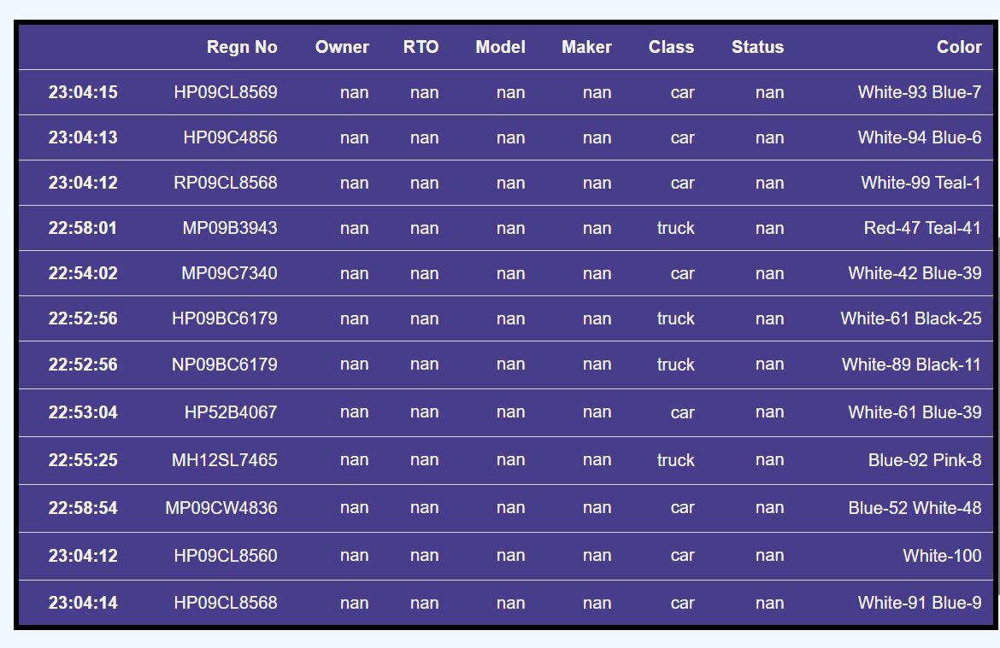

# Indian-Vehicle-License-Plate-Detection

**Basic approach** <br/>
Take a ConvNet pretrained on Yolo, remove the last fully-connected layer , then treat the rest of the ConvNet as a fixed feature extractor for the new dataset.then, train a linear classifier (e.g. Linear SVM or Softmax classifier) for the new dataset.
Use python getdataset.py to download the dataset and generate annotation files for training. <br/>
**Why Transfer learning** <br/>
The dataset available to us is very minimal appx. 400 images only so, it is best to leverage Transfer learning for good results.
Instead of building the model from scratch, we will be using a pre-trained network and applying transfer learning to create our final model. You only look once (YOLO) is a state-of-the-art, real-time object detection system, which has a mAP on VOC 2007 of 78.6% and a mAP of 48.1% on the COCO test-dev. YOLO applies a single neural network to the full image. This network divides the image into regions and predicts the bounding boxes and probabilities for each region. These bounding boxes are weighted by the predicted probabilities.

[](output/op.PNG)<br/>
**Below given descriptions don't train model but uses the trained model weights for testing purposes**
# For Windows users
Download tesseract OCR for windows from [here](https://digi.bib.uni-mannheim.de/tesseract/tesseract-ocr-w64-setup-v5.0.0.20190526.exe)
It makes use of python-Tesseract OCR. <br />
For that change the path of Tesseract OCR in files license_detection.py and yolo_license_detection.py to where it installed on your system.

Weights files for the model can be accesed [here](https://drive.google.com/drive/folders/11Y3Dmp4BPTZzpo4TLB328OESpx9k0dkJ?usp=sharing)

Put yolo-v3-tiny_last.weights files inside yolo-coco/   <br />
Put other two files directly in the main folder.
```
pip install pytesseract
```

To detect license plate having a single car use mainfile.py <br />
```
python mainfile.py --image images/car.jpg
```
To detect license plate  for each vehicle in a **image having multiple cars** use multiple_cars.py <br />
```
python multiple_cars.py images/mult_cars.png
```
**press 'q' to get close output window after running above commands**
**put relative image path as images/car.png for testing purpose**
<br/>
**Output images are inside output/image**
# For linux users
**The files mainfile.py and multiple_cars.py will not directly work in Linux as tesseract OCR dependency is not tested with linux** 
<br/>
**OCR not tested in linux but license detection model works same**
<br/>
```
python without_ocr.py --image images/car.jpg <br/>

python without_ocr_multiple_cars.py  <br />  **put relative image path as images/car.png for testing purpose**
```

One of the advantages of YOLO is that it looks at the whole image during the test time, so its predictions are informed by global context in the image. Unlike R-CNN, which requires thousands of networks for a single image, YOLO makes predictions with a single network. This makes this algorithm extremely fast, over 1000x faster than R-CNN and 100x faster than Fast R-CNN. <br/>
**Training the model** <br/>
Training is done using [Darknet](https://github.com/AlexeyAB/darknet?files=1#how-to-train-tiny-yolo-to-detect-your-custom-objects) framework.
<br/>

# License plate detection in Live video streams
[Wpod-net](http://openaccess.thecvf.com/content_ECCV_2018/html/Sergio_Silva_License_Plate_Detection_ECCV_2018_paper.html) is used for detecting License plate. It is novel Convolutional Neural Network (CNN) capable of detecting and rectifying multiple distorted license plates in a single image, which are fed to an Optical Character Recognition (OCR) method to obtain the final result.
- First License plates is detected
- Then each license plate undergoes pre-processing followed by character seperation using Image processing i.e. Each char of license plate is seperated. Also, in case if License plate is in two lines(Aspect ratio in certain range), it is cut horizontally in between and concatnated from sides to get all characters in single line.
- Each cropped character is passed through character recogntion model to determine the character.
- Progrmmatic correction to detected text is also Done to remove mistakes made by character recognizer.
- Color of vehicle is determined.
- Type of vehicle is determined (Bus/Car/Truck)
<b>Sample results</b>


# References
[DarkNet (YOLOv2](https://pjreddie.com/darknet/yolov2/) <br/>
[You Only Look Once: Unified, Real-Time Object Detection – Joseph Redmon, Santosh Divvala, Ross Girshick, Ali Farhadi](https://arXiv:1612.08242) <br/>
[YAD2K: Yet Another Darknet 2 Keras – Allan Zelener]( https://github.com/allanzelener/YAD2K) <br/>
[Berkley Deep Driving Dataset](http://bdd-data.berkeley.edu/) <br/>
